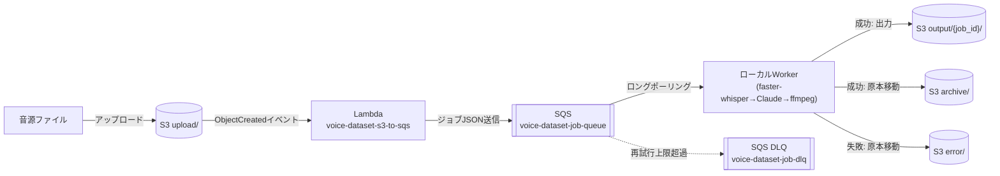

# voice-dataset-builder 設計レビュー報告書

音声クローン学習データセット生成システムの設計・実装状況の報告書。他システムでの設計レビュー用にまとめたもの。

## 1. プロジェクトの目的

会話音声（M4A/AAC等）から、音声クローン学習に使えるデータセット（話題単位で自然に区切られたwavクリップ＋メタデータ）を自動生成するシステム。

## 2. 必須制約

- **既存の音声会話AI（同一AWSアカウント上で稼働中）とはAWSリソースを一切共有しない**：IAM、Lambda、S3、CloudWatch、Secrets Manager、Parameter Store、CloudFormation/CDK、Docker、環境変数のいずれも非共有
- 命名は`voice-dataset-*`に統一し、既存システムを連想させる語（`voice-chat` / `cotomo` / `assistant`等）は使用しない
- Whisper・ffmpeg・Claude APIは**ローカルPC常駐Worker**で実行し、AWS上では実行しない（AWS料金抑制、Whisperモデルのローカル保持、ffmpeg実行の容易さのため）
- AWS利用料は**月1,000円未満**が必須要件
- 話者は1名確定という前提

## 3. システム構成（データフロー）



Lambdaは「S3イベントを受けてSQSにジョブを積むだけ」。Whisper/Claude/ffmpegはAWS上では一切実行しない。

## 4. AWSリソース構成

| 種別 | 命名 | 備考 |
|---|---|---|
| S3バケット（単一） | `voice-dataset-<AWSアカウントID>` | プレフィックス方式（4バケット分割ではない） |
| S3プレフィックス | `upload/` `output/` `archive/` `error/` | 用途別 |
| SQS本キュー | `voice-dataset-job-queue` | 可視性タイムアウト1800秒、保持4日 |
| SQS DLQ | `voice-dataset-job-dlq` | maxReceiveCount=3で移動 |
| Lambda | `voice-dataset-s3-to-sqs` | Python 3.12、S3イベントをSQSへ中継するだけ |
| IAMロール | `voice-dataset-lambda-role` | Lambda実行用、最小権限 |
| IAMユーザー | `voice-dataset-worker-user` | ローカルWorker用、最小権限 |
| CloudWatchロググループ | `/aws/lambda/voice-dataset-s3-to-sqs` | 保持14日 |
| リージョン | `ap-northeast-1` | |
| 共通タグ | `Project=voice-dataset` / `ManagedBy=terraform` | |

**現在の状態：上記すべてTerraformで実際にAWS上にデプロイ済み（本番稼働中）。**

### IAM権限（2主体のみ、最小権限）

**`voice-dataset-lambda-role`**
- `s3:GetObject`（`upload/*`のみ）
- `sqs:SendMessage`（本キューのみ）
- 自ロググループへの書き込みのみ

**`voice-dataset-worker-user`**
- `sqs:ReceiveMessage/DeleteMessage/GetQueueAttributes`（本キューのみ）
- `s3:GetObject`（`upload/*`）
- `s3:PutObject`（`output/* archive/* error/*`）
- `s3:DeleteObject`（`upload/*`、move実装のため）

Secrets Manager / Parameter Storeは不使用。AWS認証情報・Claude APIキーはローカル`.env`で管理（gitignore対象）。

## 5. ローカルWorkerの処理パイプライン

```
1. SQSをロングポーリング（WaitTimeSeconds=20）
2. S3 upload/ から音源をダウンロード
3. ffprobeでソース音質チェック（ビットレート/サンプルレート閾値未満ならerror/へ振り分け、以降の処理を行わない）
4. faster-whisper (smallモデル, CPU, int8量子化) で文字起こし（no_speech_probも取得）
5. 文字起こしテキスト（[NOISE]/[LAUGH]注記付き）のみをClaude APIへ送信し、話題境界(30秒〜3分、文の途中で区切らない)をJSON配列で取得
6. no_speech_prob・笑い声比率が閾値を超える候補区間は採用せず除外（report.mdに理由を記録）
7. ffmpegでJSON区間ごとにloudnorm(-16 LUFS, TP-1.5, LRA11)適用しつつwav切り出し (001.wav, 002.wav, ...)
8. clips.csv（file/start/end/duration/topic/reason）とreport.md（元ファイル名/抽出件数/抽出時間/話題一覧/採用理由/除外区間）を生成
9. 成果物一式をS3 output/{job_id}/ へアップロード
10. 成功時: 原本をupload/→archive/へ移動、SQSメッセージ削除
11. 失敗時: 原本をupload/→error/へ移動、SQSメッセージ削除（無限リトライ防止。DLQは別途受信上限到達時のみ）
```

### 音質ゲート（ベストエフォート、要レビュー観点）

話者1名確定という前提のもと実装。**非可逆圧縮による音質劣化そのものを復元・保証するものではなく、「明らかに使えない音源・区間を機械的に弾く」ことが目的**：

- ソース音質チェック：ビットレート`MIN_BITRATE_KBPS`(既定96kbps)、サンプルレート`MIN_SAMPLE_RATE_HZ`(既定32000Hz)未満を却下
- ラウドネス正規化：クリップ単位でffmpeg `loudnorm`適用
- 無音/雑音区間の除外：Whisperの`no_speech_prob`が閾値(既定0.5)超で除外
- 笑い声区間の除外：**正規表現ベース**（「あはは」「www」「(笑)」等のパターンマッチ）で、区間内の笑い声比率が閾値(既定0.3)超で除外。Whisperが笑い声をテキスト化しなかった場合は検知できない、既知の限界あり
- 話者複数混在の検知は未実装（話者1名確定の前提のため対応不要と判断）

## 6. ディレクトリ構成

```
voice-dataset-builder/
├── infra/                  Terraform一式（S3/SQS/Lambda/IAM）+ deploy.sh（apply後にworker/.envを自動生成）
├── lambda/s3_to_sqs/       S3イベント→SQS投入Lambda
├── worker/                 ローカル常駐Worker（Python）+ setup.sh + local_test.py（AWS不要のオフライン検証用）
└── docs/                   設計ドキュメント
```

## 7. デプロイ自動化

- `infra/deploy.sh`：`terraform init/plan/apply`を実行し、出力値（バケット名・キューURL・Worker用アクセスキー）を自動で`worker/.env`へ書き込む
- `worker/setup.sh`：Python仮想環境の作成・依存パッケージインストールを自動化
- `worker/local_test.py`：AWSを一切使わず、ローカルの音声ファイルだけでWhisper→Claude→ffmpegの一連処理を検証できるスクリプト（AWSデプロイ前の疎通確認用）

## 8. 現在の状況

- インフラは実際にAWS上にTerraformでデプロイ済み（新規追加20リソース、既存リソースの変更・削除は0件）
- ローカルWorkerを起動し、実運用に近い2時間18分の会話音声ファイルで初の実地テストを実施中
- テスト中に判明した課題：長時間音声だとWhisperの文字起こしに時間がかかり進捗が見えづらかったため、各処理段階のログ出力を追加済み
- 同じく長時間音声だと、Claudeへの区間分割依頼の出力（JSON）が出力上限(`max_tokens`)に達し途中で切れる懸念があったため、4096→8192に拡大し、JSON解析失敗時にその旨がわかるエラーメッセージを追加済み（この対策の実地検証はテスト継続中）

## 9. コスト

Whisper/ffmpeg/Claude APIをローカルへ逃がしているため、AWS側はS3・SQS・Lambda・CloudWatch Logsのみで月200円程度の想定（要件: 月1,000円未満）。Claude API・Whisperローカル実行の実費は別途。

## 10. 設計レビューで特にご意見をいただきたい点

1. **長時間音声への対応**：現状は1回のClaude呼び出しで全区間を一括取得する設計。数時間規模の音声では出力トークン上限に達するリスクが残る。文字起こしをチャンク分割して複数回Claudeに依頼する設計への変更要否
2. **笑い声検知の精度**：正規表現＋no_speech_probのみのベストエフォート実装。音声信号処理ベースの検知（無音区間検知の精度向上、感情/イベント検出モデルの導入等）に発展させるべきか
3. **Terraform state管理**：現状ローカルstateのみ（単一運用者を想定）。将来的な複数人運用やCI化を見据えてS3+DynamoDBのリモートバックエンドへ移行すべきタイミング
4. **IAMブートストラップ運用**：インフラ構築時のみ使う管理者IAMユーザー（`AdministratorAccess`付与）を都度作成・削除する運用でよいか、恒久的な最小権限の運用フローを別途設計すべきか
5. **エラー通知**：現状はS3 error/プレフィックスへの機械的な振り分けとCloudWatch Logsのみで、能動的な通知（SNS等）は未実装（コスト最小化のため意図的に見送り）。この判断の妥当性
